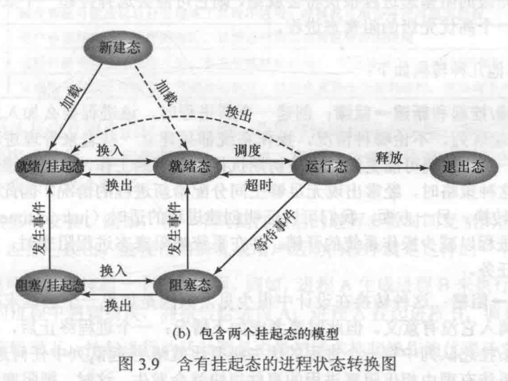
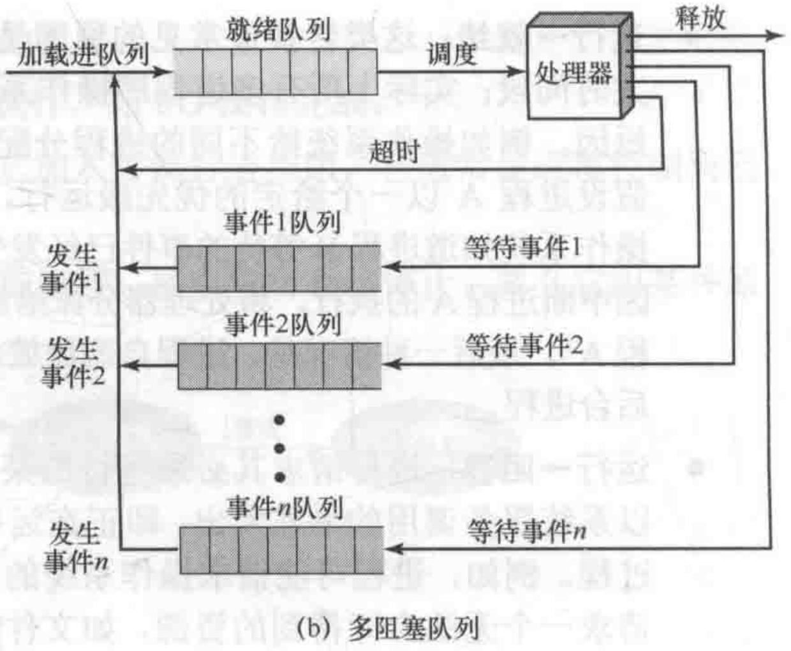

# Ch3
## Question
### 3.5
Consider the state transition diagram of Figure 3.9b. Suppose that it is time for the OS to dispatch a process and that there are processes in both the Ready state and the Ready/Suspend state, and that at least one process in the Ready/Suspend state has higher scheduling priority than any of the processes in the Ready state. Two extreme policies are as follows: (1) Always dispatch from a process in the Ready state, to minimize swapping, and (2) always give preference to the highest-priority process, even though that may mean swapping when swapping is not necessary. Suggest an intermediate policy that tries to balance the concerns of priority and performance.

### 3.9
Figure 3.8b suggests that a process can only be in one event queue at a time.
- a. Is it possible that you would want to allow a process to wait on more than one event at the same time? Provide an example.
- b. In that case, how would you modify the queueing structure of the figure to support this new feature?

---
