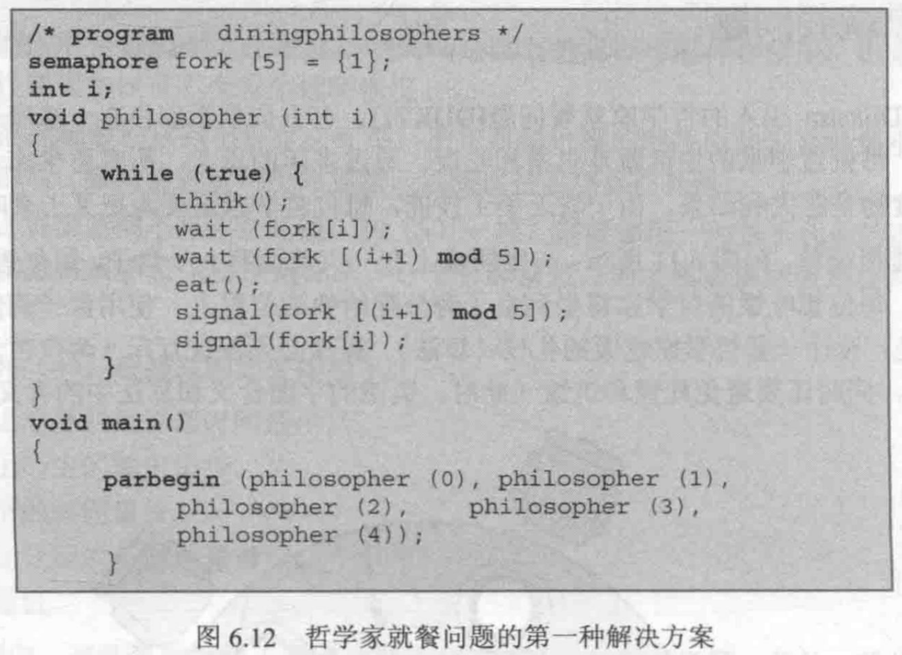

# Ch6
## Question
### 6.11.
Consider a system with a total of 150 units of memory, allocated to three processes as shown:

| Process | Max | Hold |
| ------- | --- | ---- |
| 1       | 70  | 45   |
| 2       | 60  | 40   |
| 3       | 60  | 15   |

Apply the banker's algorithm to determine whether it would be safe to grant each of the following requests. If yes, indicate a sequence of terminations that could be guaranteed possible. If no, show the reduction of the resulting allocation table.
- a. A fourth process arrives, with a maximum memory need of 60 and an initial need of 25 units.
- b. A fourth process arrives, with a maximum memory need of 60 and an initial need of 35 units.

### 6.16.
Consider the following ways of handling deadlock: (1) banker's algorithm, (2) detect deadlock and kill thread, releasing all resources, (3) reserve all resources in advance, (4) restart thread and release all resources if thread needs to wait, (5) resource ordering, and (6) detect deadlock and roll back thread's actions.
- a. One criterion to use in evaluating different approaches to deadlock is which approach permits the greatest concurrency. In other words, which approach allows the most threads to make progress without waiting when there is no dead-lock? Give a rank order from 1 to 6 for each of the ways of handling deadlock just listed, where 1 allows the greatest degree of concurrency. Comment on your ordering.
- b. Another criterion is efficiency; in other words, which requires the least processor overhead. Rank order the approaches from 1 to 6, with 1 being the most efficient, assuming that deadlock is a very rare event. Comment on your ordering. Does your ordering change if deadlocks occur frequently?

### 6.18.
Suppose that there are two types of philosophers. One type always picks up his left fork first (a "lefty"), and the other type always picks up his right fork first (a "righty"). The behavior of a lefty is defined in Figure 6.12. The behavior of a righty is as follows:
```pseudocode
begin
	repeat
		think;
		wait ( fork[ (i+1) mod 5 ] );
		wait ( fork[i] );
		eat;
		signal ( fork[i] );
		signal ( fork[ (i+1) mod 5 ] );
	forever
end;
```

Prove the following:
- a. Any seating arrangement of lefties and righties with at least one of each avoids deadlock.
- b. Any seating arrangement of lefties and righties with at least one of each prevents starvation.



---

## Answer
### 6.11.
- a. 2 -> 1 -> 4 -> 3
- b. No
	  Available: 150 - 45 - 40 - 15 - 35 = 15
	  
  | Process | Max | Hold | Needs |
  | - | - | - | - |
  | 1 | 70 | 45 | 15 |
  | 2 | 60 | 40 | 20 |
  | 3 | 60 | 15 | 45 |
  | 4 | 60 | 35 | 25 |

### 6.16.
- a. (4) > (2) = (6) > (5) (if fewer requests first) > (1) > (3)
  (4) makes the most resources available; (2) and (6) permit concurrent execution when no deadlock exists; (5) allows more processes to execute by ordering resources, but this depends on the order; (1) and (3) require reserving resources, with (1) can manage allocation
- b. (4) > (3) > (1) > (5) > (2) > (6)
  Since deadlock is very rare, so the algorithm's efficiency becomes the key criterion. (4) only needs to check if the process is waiting; (3) is more efficient than (1)'s banker's algorithm's since there is no management of the reservation; and reserving outperforms (5)'s ordering; deadlock detection in (2) and (6) is the most complex one, and (6)'s rolling back requires more than (2)'s killing
  Yes

### 6.18.
- a. Deadlock occurs when everyone holds only one of the fork and waits forever for the other. However, this cannot happen if there is both lefty and righty since their fork acquisition order are opposite, there must exist a least one pair of adjacent philosophers competing for the same fork but in different orders, so one of them can start eating.
- b. Starvation happens when the folk next to a philosopher is always occupied by others, or in other words, is never released by its neighbor. And this only happens when the neighbor's neighbor never releases. So this constitutes a deadlock. According to a., deadlock is impossible, so starvation is impossible.
