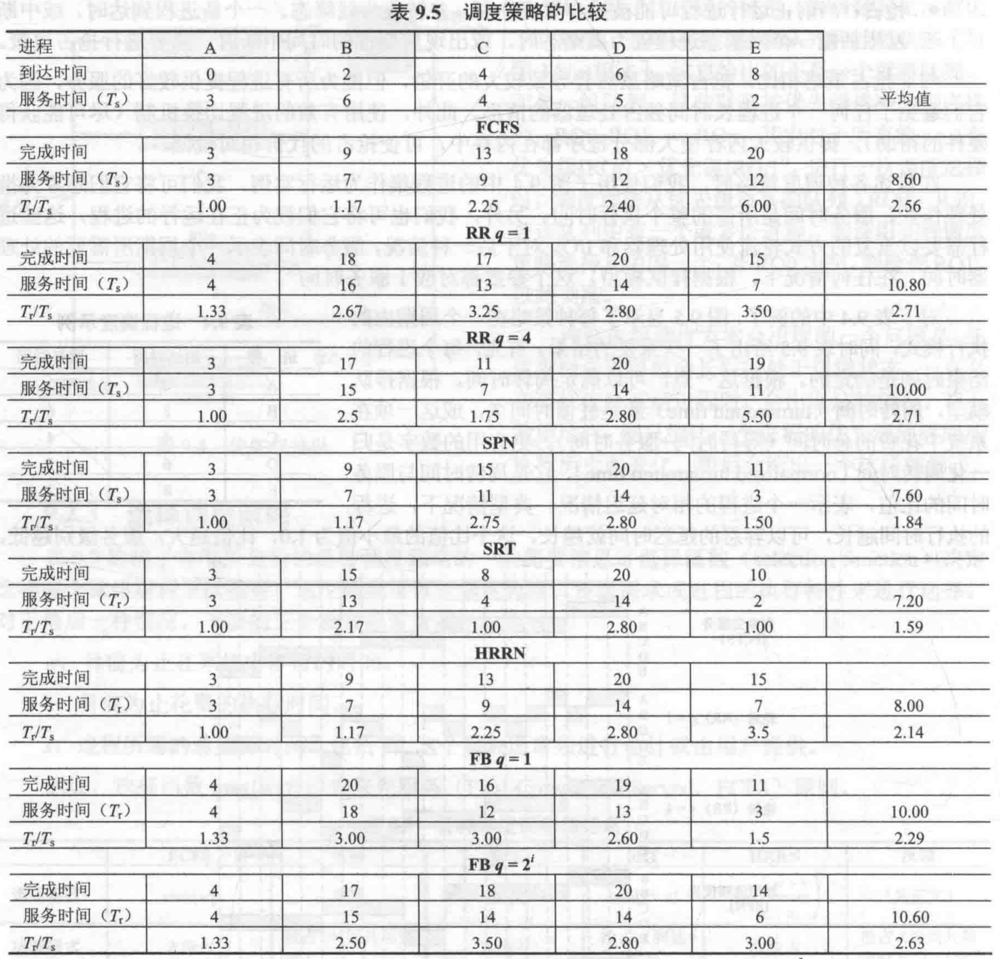
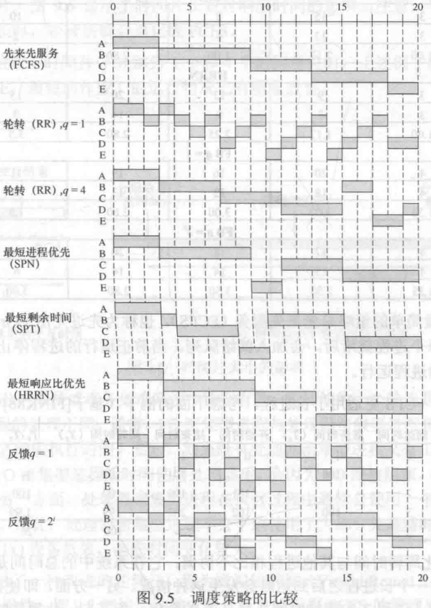

# Ch9
## Question
### 9.2.
Consider the following set of processes:

| Process | Arrival Time | Processing Time |
| ------- | ------------ | --------------- |
| A       | 0            | 3               |
| B       | 1            | 5               |
| C       | 3            | 2               |
| D       | 9            | 5               |
| E       | 12           | 5               |

Perform the same analysis as depicted in Table 9.5 and Figure 9.5 for this set.

### 9.3.
Prove that, among nonpreemptive scheduling algorithms, SPN provides the minimum average waiting time for a batch of jobs that arrive at the same time. Assume that the scheduler must always execute a task if one is available.

---

## Answer
### 9.2.
#### FCFS
| Process | Finishing time | $T_s$ | $T_r$/$T_s$ |
| ------- | -------------- | ----- | ----------- |
| A       | 3              | 3     | 1.00        |
| B       | 8              | 7     | 1.40        |
| C       | 10             | 7     | 3.50        |
| D       | 15             | 6     | 1.20        |
| E       | 20             | 8     | 1.60        |

Avg $T_s \approx 6.20$
Avg $T_r$/$T_s$$\approx 1.74$

```mermaid
gantt
	title FCFS
	dateFormat X
	axisFormat %s
	section A
		A1:0,3
	section B
		B1:3,8
	section C
		C1:8,10
	section D
		D1:10,15
	section E
		E1:15,20

```

#### RR q=1
| Process | Finishing time | $T_s$ | $T_r$/$T_s$ |
| ------- | -------------- | ----- | ----------- |
| A       | 6              | 6     | 2.00        |
| B       | 11             | 10    | 2.00        |
| C       | 8              | 5     | 2.50        |
| D       | 18             | 9     | 1.80        |
| E       | 20             | 8     | 1.60        |

Avg $T_s \approx 7.60$
Avg $T_r$/$T_s$$\approx 1.98$

```mermaid
gantt
	title RR q=1
	dateFormat X
	axisFormat %s
	section A
		A1:0,1
		A2:2,3
		A3:5,6
	section B
		B1:1,2
		B2:3,4
		B3:6,7
		B4:8,9
		B5:10,11
	section C
		C1:4,5
		C2:7,8
	section D
		D1:9,10
		D2:11,12
		D3:13,14
		D4:15,16
		D5:17,18
	section E
		E1:12,13
		E2:14,15
		E3:16,17
		E4:18,20

```

#### RR q=4
| Process | Finishing time | $T_s$ | $T_r$/$T_s$ |
| ------- | -------------- | ----- | ----------- |
| A       | 3              | 3     | 1.00        |
| B       | 18             | 17    | 3.40        |
| C       | 9              | 6     | 2.00        |
| D       | 19             | 10    | 2.00        |
| E       | 20             | 8     | 1.60        |

Avg $T_s \approx 8.80$
Avg $T_r$/$T_s$$\approx 2.00$

```mermaid
gantt
	title RR q=4
	dateFormat X
	axisFormat %s
	section A
		A1:0,3
	section B
		B1:3,7
		B2:17,18
	section C
		C1:7,9
	section D
		D1:9,13
		D2:18,19
	section E
		E1:13,17
		E2:19,20

```

#### SPN
| Process | Finishing time | $T_s$ | $T_r$/$T_s$ |
| ------- | -------------- | ----- | ----------- |
| A       | 3              | 3     | 1.00        |
| B       | 10             | 9     | 1.80        |
| C       | 5              | 2     | 1.00        |
| D       | 15             | 6     | 1.20        |
| E       | 20             | 8     | 1.60        |

Avg $T_s \approx 5.60$
Avg $T_r$/$T_s$$\approx 1.32$

```mermaid
gantt
	title SPN
	dateFormat X
	axisFormat %s
	section A
		A1:0,3
	section B
		B1:5,10
	section C
		C1:3,5
	section D
		D1:10,15
	section E
		E1:15,20

```

#### SRT
| Process | Finishing time | $T_s$ | $T_r$/$T_s$ |
| ------- | -------------- | ----- | ----------- |
| A       | 3              | 3     | 1.00        |
| B       | 10             | 9     | 1.80        |
| C       | 5              | 2     | 1.00        |
| D       | 15             | 6     | 1.20        |
| E       | 20             | 8     | 1.60        |

Avg $T_s \approx 5.60$
Avg $T_r$/$T_s$$\approx 1.32$

#### HRRN
| Process | Finishing time | $T_s$ | $T_r$/$T_s$ |
| ------- | -------------- | ----- | ----------- |
| A       | 3              | 3     | 1.00        |
| B       | 8              | 7     | 1.40        |
| C       | 10             | 7     | 3.50        |
| D       | 15             | 6     | 1.20        |
| E       | 20             | 8     | 1.60        |

Avg $T_s \approx 6.20$
Avg $T_r$/$T_s$$\approx 1.74$

#### Feedback q=1
| Process | Finishing time | $T_s$ | $T_r$/$T_s$ |
| ------- | -------------- | ----- | ----------- |
| A       | 7              | 7     | 2.33        |
| B       | 18             | 17    | 3.40        |
| C       | 6              | 3     | 1.50        |
| D       | 19             | 10    | 2.00        |
| E       | 20             | 8     | 1.60        |

Avg $T_s \approx 9.00$
Avg $T_r$/$T_s$$\approx 2.17$

```mermaid
gantt
	title Feedback q=1
	dateFormat X
	axisFormat %s
	section A
		A1:0,1
		A2:2,3
		A3:6,7
	section B
		B1:1,2
		B2:4,5
		B3:7,9
		B4:17,18
	section C
		C1:3,4
		C2:5,6
	section D
		D1:9,12
		D2:15,16
		D3:18,19
	section E
		E1:12,15
		E2:16,17
		E3:19,20

```

#### Feedback q=2\^i
| Process | Finishing time | $T_s$ | $T_r$/$T_s$ |
| ------- | -------------- | ----- | ----------- |
| A       | 4              | 4     | 1.33        |
| B       | 10             | 9     | 1.80        |
| C       | 8              | 5     | 2.50        |
| D       | 16             | 11    | 2.20        |
| E       | 20             | 8     | 1.60        |

Avg $T_s \approx 7.40$
Avg $T_r$/$T_s$$\approx 28.22$

```mermaid
gantt
	title Feedback q=2^i
	dateFormat X
	axisFormat %s
	section A
		A1:0,1
		A2:2,4
	section B
		B1:1,2
		B2:5,7
		B3:8,10
	section C
		C1:4,5
		C2:7,8
	section D
		D1:10,13
		D2:14,16
	section E
		E1:13,14
		E2:16,20

```

### 9.3.
$\operatorname{Avg}{(T_w)} = \frac{\sum_{i=1}^{n}{(n-i) T_i}}{n}$
Where $T_i$ is service time for the i-th executed process. This formula can be seen as a weighted sum of the execution time. Since all parameters are constant except for the order in which service times are paired with the weights. And SPN provides a non-decreasing order of service times, which ensures that the non-increasing weights are multiplied to the non-decreasing service times.
