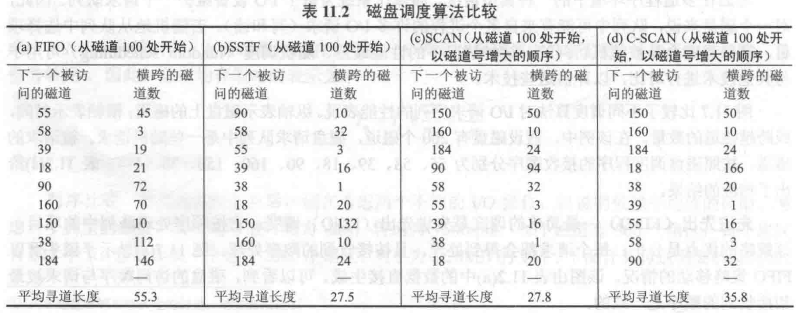

# Ch11
## Question
### 11.3.
- a. Perform the same type of analysis as that of Table 11.2 for the following sequence of disk track requests: 27, 129, 110, 186, 147, 41, 10, 64, 120. Assume that the disk head is initially positioned over track 100 and is moving in the direction of decreasing track number.
  
- b. Do the same analysis, but now assume that the disk head is moving in the direction of increasing track number.

### 11.10.
A 32-bit computer has two selector channels and one multiplexor channel. Each selector channel supports two magnetic disk and two magnetic tape units. The multiplexor channel has two line printers, two card readers, and ten VDT terminals connected to it.
Assume the following transfer rates:

|                     |              |
| ------------------- | ------------ |
| Disk drive          | 800 Kbytes/s |
| Magnetic tape drive | 200 Kbytes/s |
| Line printer        | 6.6 Kbytes/s |
| Card reader         | 1.2 Kbytes/s |
| VDT                 | 1 Kbyte/s    |

Estimate the maximum aggregate I/O transfer rate in this system.

## Answer
### 11.3.

### 11.10.
